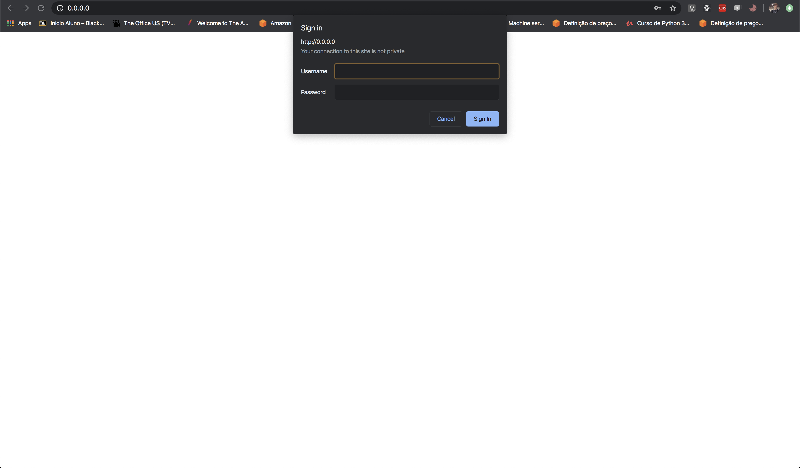
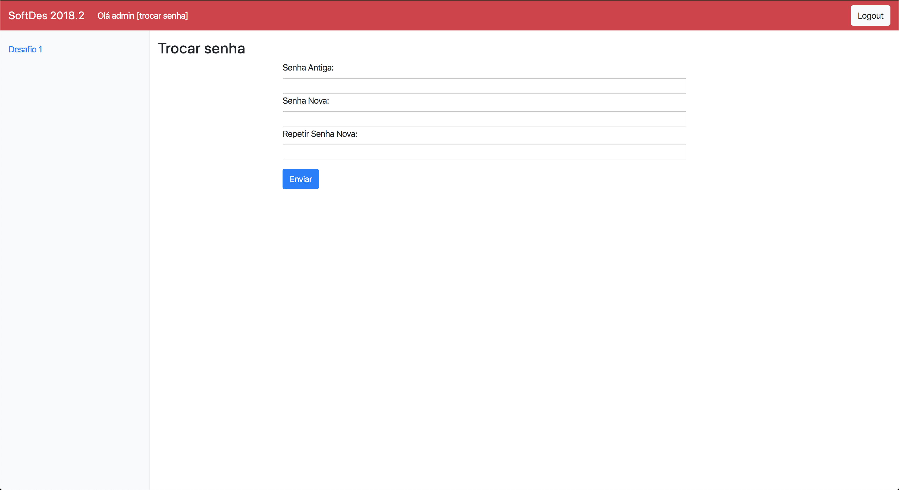

# Guia do aluno

Primeiramente acesse o endereço do [projeto](www.servidordedesafios.com) com o seu navegador.

Faça o login com seu usuário e senha que seu professor enviou.

Ao logar, essa é a tela inicial onde você pode enviar uma solução para o desafio. Para fazer isso, bast clicar no botão
_choose file_, escolher o arquivo da solução, e por fim, clicar no botão Enviar.

Logo após, é possível verificar o feedback dos envios abaixo. Ele apresenta a Data do envio, um Feedback escrito e o
Resultado daquela solução.

É possível também trocar a senha do usuário nessa tela. Basta colocar a senha antiga e a senha nova para conseguir trocar.

## Página Inicial
Veja a página [inicial](index.md) para mais detalhes.

## Guia do professor
Veja a página [guia do professor](professor.md) para mais detalhes.

## Guia de desenvolvimento
Veja a página [guia do desenvolvimento](desenvolvimento.md) para mais detalhes.

## Documentação da API
Veja a página [API](api.md) para mais detalhes.