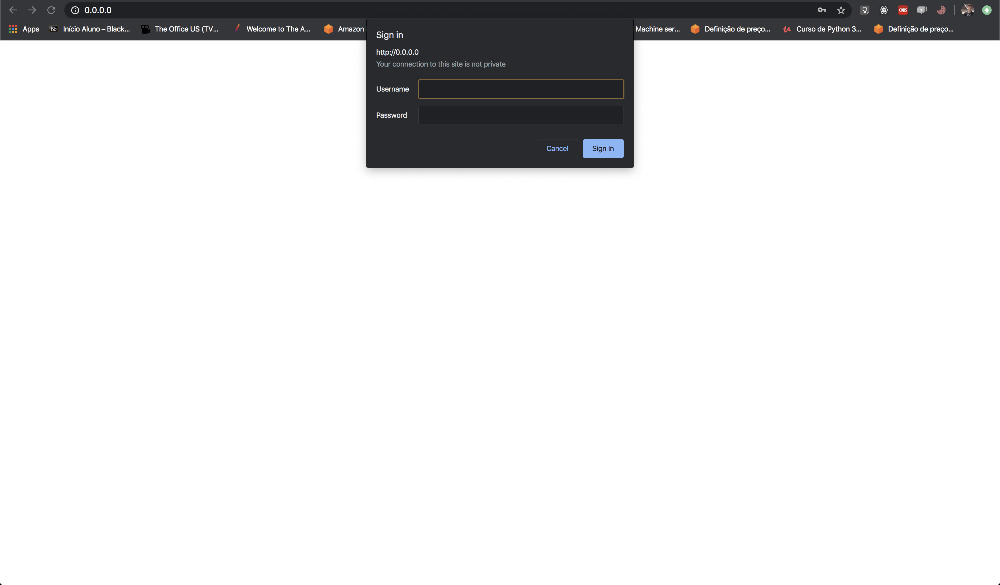
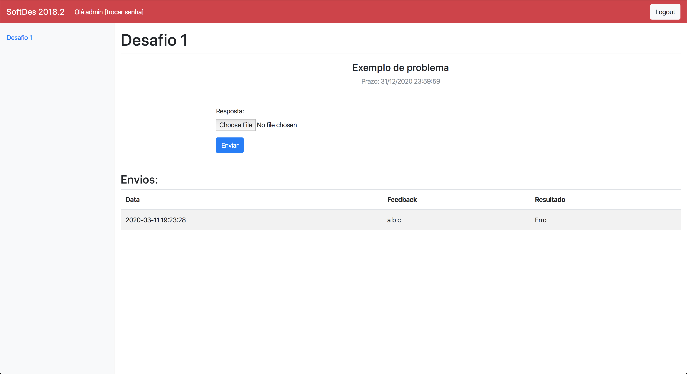
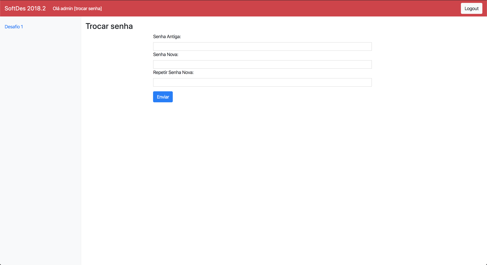

# Servidor de Desafios

## O que é?
O servidor de desafios tem como função auxiliar a disciplina de Design de Software (ministrada a todos os alunos de engenharia do Insper no 1º semestre)

Com esse servidor, os alunos podem enviar as soluções dos problemas propostos pelo professor da matéria. Após dar upload 
na sua solução proposta, o aluno tem um avaliação feedback de sua atividade.

## Uso

Primeiramente é feito o login na plataforma, utilize o usuário e a senha:

Ao logar, essa é a tela inicial apresentada ao usuário.  

É possível também trocar a senha do usuário nessa tela. Basta colocar a senha antiga e a senha nova para conseguir trocar.

## Guia do aluno
Veja a página [guia do aluno](aluno.md) para mais detalhes. 

## Guia do professor
Veja a página [guia do professor](professor.md) para mais detalhes. 

## Guia de desenvolvimento
Veja a página [guia do desenvolvimento](desenvolvimento.md) para mais detalhes. 

## Documentação da API
Veja a página [API](api.md) para mais detalhes. 
